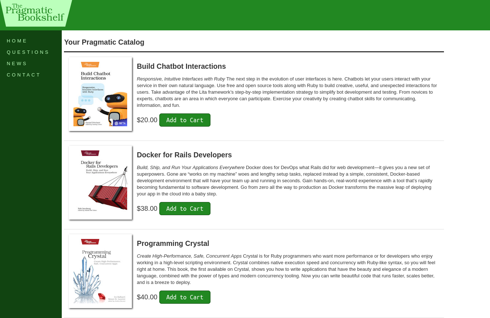

# Depot Application

This application was produced when reading the [Agile Web Development with Rails 6](https://pragprog.com/titles/rails6/agile-web-development-with-rails-6/) book.

I learnt a lot from the book including:
- Unit and system tests
- JS erb files to facilitate AJAX
- Creating Atom feeds
- Sending email
- Creating custom basic authentication and authorisation system
- Internationalization
- Receiving email and responding with rich text

## Setup

### Requirements

- Ruby 2.6.5 (This is now unsupported, DO NOT USE in production)
- Rails 6.0.1
- Nodejs 12.22.12

### Commands

- asdf install ruby 2.6.5
- asdf local ruby 2.6.5
- Confirm ruby 2.6.5 is set using ruby -v

- gem install bundler:2.3.21
- bundle install

- asdf install nodejs 12.22.12
- asdf local nodejs 12.22.12
- npm install yarn
- npm install -g yarn
- yarn install

- bundle exec rails db:migrate 
- bundle exec rails db:seed
- bundle exec rails s

### Access Application

- Visit [127.0.0.1:3000](http://127.0.0.1:3000/)

- Admin login is [here](127.0.0.1:3000/admin)
- Default admin credentials are *dave:secret*

### Run tests

- bundle exec rails test
- bundle exec rails test:system
